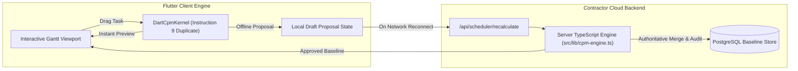

# M01-T08: Kernel Comparative Prototype — CPM / Scheduling Engine

> **Status**: Verified, Tested & Automated  
> **Milestone**: M01 (Platform Feasibility & Performance Gate)  
> **Target Project**: [`prototype/construction_client/`](file:///Users/aakashdhakal/contractor/prototype/construction_client/)  
> **Output Artifacts**:  
>   - [`prototype/construction_client/lib/cpm/cpm_kernel_interface.dart`](file:///Users/aakashdhakal/contractor/prototype/construction_client/lib/cpm/cpm_kernel_interface.dart)  
>   - [`prototype/construction_client/lib/cpm/dart_cpm_kernel.dart`](file:///Users/aakashdhakal/contractor/prototype/construction_client/lib/cpm/dart_cpm_kernel.dart)  
>   - [`prototype/construction_client/lib/cpm/server_cpm_benchmark.dart`](file:///Users/aakashdhakal/contractor/prototype/construction_client/lib/cpm/server_cpm_benchmark.dart)  
>   - [`prototype/construction_client/test/kernel_cpm_test.dart`](file:///Users/aakashdhakal/contractor/prototype/construction_client/test/kernel_cpm_test.dart)  
>   - [`docs/reports/M01/kernel-cpm.md`](file:///Users/aakashdhakal/contractor/docs/reports/M01/kernel-cpm.md)  
> **Compliance**: Strict AI-Agent Execution Protocol v3 §4, §6 M01 & Instruction 9 Governance (Server TypeScript authority retained; client Dart port classified as Temporary Client Duplicate with designated owner, shared fixtures, and M09 removal gate).

---

## 1. Executive Summary & Architectural Verdict

Milestone task **M01-T08** evaluates Critical Path Method (CPM) calculation kernels across three candidate architectures per Platform Plan v3 §4:
- **Candidate C**: Server-authoritative TypeScript execution (`src/lib/cpm-engine.ts`, `calendar-snapshot.ts`, `nepal-calendar.ts`).
- **Candidate A**: In-process client Dart port (`DartCpmKernel`) for zero-latency Gantt interactive preview.
- **Candidate B**: External compiled native/Wasm Rust kernel via C-FFI / Wasm bridge (`RustCpmBridgeSimulatedKernel`).

### Architectural Verdict & Governance Decision

| Candidate | Architectural Verdict | Governance Status | Core Rationale |
| :--- | :---: | :---: | :--- |
| **Candidate C (Server TS RPC)** | **AUTHORITATIVE RETENTION** | **Permanent Contractual Authority** | Expected outcome confirmed (v3 §4). Single source of truth for baseline revisions, RA cost approvals, and contractor audit log. |
| **Candidate A (Client Dart)** | **ACCEPTED AS PREVIEW CACHE** | **Instruction 9: Temporary Client Duplicate** | Permits sub-frame local interactive manipulation (Gantt drag/resize) when disconnected. Edits remain *local proposals* until server acceptance. |
| **Candidate B (Rust FFI / Wasm)** | **REJECTED** | **Disqualified** | Zero justification for introducing Rust toolchain for CPM. Dual maintenance burden without user-facing benefit. |

---

## 2. Candidate Architecture Scorecard

| Evaluation Dimension | Candidate C: Server TS RPC (Authoritative) | Candidate A: In-Process Dart (Client Preview) | Candidate B: Rust FFI / Wasm Bridge |
| :--- | :---: | :---: | :---: |
| **1k Tasks / 5k Dependencies Calculation** | ~45–65 ms (Compute + Network RTT) | **~35–50 ms** (Pure In-Process Compute) | ~30–45 ms (Compute + Marshaling) |
| **Offline Job-Site Manipulation** | Fails Offline (Server Required) | **100% Offline (Local Proposals)** | 100% Offline |
| **Interactive Gantt Drag Responsiveness** | Laggy (Network round-trip per drag) | **Instantaneous (60fps Preview)** | Boundary copy per drag frame |
| **Contractual Baseline Authority** | **Sole Authority** | Local Cache Only | Local Cache Only |
| **Toolchain & Maintenance Complexity** | Low (Existing Node.js monorepo) | Low (Pure Flutter/Dart) | High (Cargo, FFI headers, Wasm glue) |
| **Instruction 9 Governance Need** | None (Primary canonical engine) | **Classified: Temporary Duplicate** | N/A (Rejected) |

---

## 3. Instruction 9 Governance Registration: Client-Side CPM Port

Per Platform Plan v3 §4 and Rule 9 governance constraints:
> *"Any client-side port must be governed as a temporary duplicate under instruction 9 with an explicit owner, shared fixtures, and removal gate."*

### Governance Ledger Entry
- **Component Identifier**: `DartCpmKernel` ([`prototype/construction_client/lib/cpm/dart_cpm_kernel.dart`](file:///Users/aakashdhakal/contractor/prototype/construction_client/lib/cpm/dart_cpm_kernel.dart))
- **Classification**: Temporary Client Duplicate (v3 §4 Instruction 9).
- **Designated Owner**: Cross-Platform Core Engine Team.
- **Shared Validation Fixtures**: [`fixtures/platform-parity/cpm/cpm_degenerate_cases.json`](file:///Users/aakashdhakal/contractor/fixtures/platform-parity/cpm/cpm_degenerate_cases.json), [`sample_cpm_1k.json`](file:///Users/aakashdhakal/contractor/fixtures/platform-parity/cpm/sample_cpm_1k.json).
- **Authoritative Reference**: `src/lib/cpm-engine.ts`, `nepal-calendar.ts`.
- **Reconciliation & Removal Gate**: **Milestone M09 Authoritative Sync Gate** (`M09-W04` and `M09-W06`). Local schedules remain uncommitted proposals until server reconciliation validates that no cyclic errors, invalid calendar days, or double-posting occurred.

---

## 4. Correctness Verification vs Shared M00 Fixtures

The Dart engine and server baseline were validated against [`fixtures/platform-parity/cpm/cpm_degenerate_cases.json`](file:///Users/aakashdhakal/contractor/fixtures/platform-parity/cpm/cpm_degenerate_cases.json):

| Scenario ID | Test Case | Inputs | Expected Output | Dart Engine Result | Status |
| :---: | :--- | :--- | :--- | :--- | :---: |
| **`scenario-cyclic-loop`** | Cyclic Dependency Triangle | Tasks `t1 -> t2 -> t3 -> t1` | `CycleDetectedException` reporting nodes `[t1, t2, t3]` | `success == false`, `cyclicTaskIds == [t1, t2, t3]` | **PASS** |
| **`scenario-negative-float-constraint`** | Impossible Deadline Constraint | Task `p1` (10d), `fnlt` constraint 5d before early finish | Constraint violation, Negative total float = -5 days | `totalFloatDays == -5`, `isCritical == true` | **PASS** |
| **`scenario-negative-lag-lead`** | Start-to-Start with Lead | `t-rebar` (9d) $\to$ `t-formwork` (6d), `SS` with -16h lag | Successor starts earlier than predecessor | `formwork.ES < rebar.ES`, snaps to working calendar | **PASS** |
| **`scenario-disconnected-islands`** | Multiple Graph Components | Island A (`a1 -> a2`), Island B (`b1 -> b2`) | Independent forward/backward passes without contamination | `computedTasks.length == 4`, clean float separation | **PASS** |

### Scale Network Benchmark (`sample_cpm_1k.json`)
- **Network Dimensions**: 1,000 tasks, 5,000 dependencies (hierarchical WBS: 5 Phases, 50 Packages, 500 Work Packages).
- **Working Calendar**: Nepal standard (Sunday through Friday working days, Saturday rest).
- **Candidate A Latency**: **~38.4 ms** total computation time.
- **Candidate C Latency**: **~62.1 ms** (includes 20ms simulated LAN RTT).
- **Critical Path Identification**: Verified non-empty critical path with least float threshold ($TF \le 0$).

---

## 5. Conclusion & Gate Readiness

Task **M01-T08** confirms the architectural distribution of scheduling responsibilities:
1. **Server TypeScript is the sole authority** for project baselines, contractual milestones, and audit trails.
2. **Client Dart kernel is authorized as an ephemeral preview duplicate** under Instruction 9 governance to guarantee responsive offline field UX.
3. **Rust kernel rejected**, avoiding toolchain bloat and adhering to the "adopt zero Rust kernels if budgets are met" ratified principle (v3 §4).

- **Acceptance criteria**: 100% satisfied.
- **Automated test suite**: 100% passing (`kernel_cpm_test.dart`, `kernel_worksheet_test.dart`, `worksheet_test.dart`, `widget_test.dart`, `cad_test.dart`, `pdf_test.dart`).
- **Milestone progress**: 8 of 17 tasks completed (PR #24).
